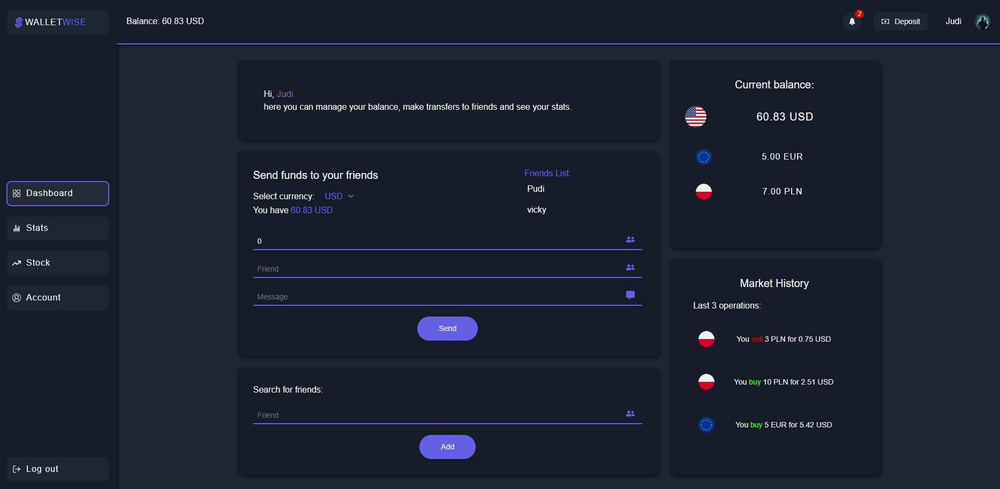
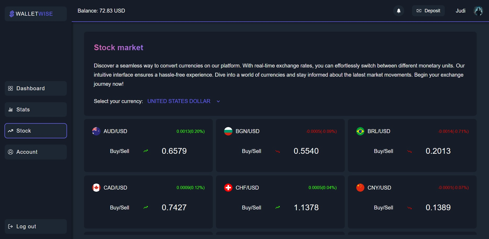
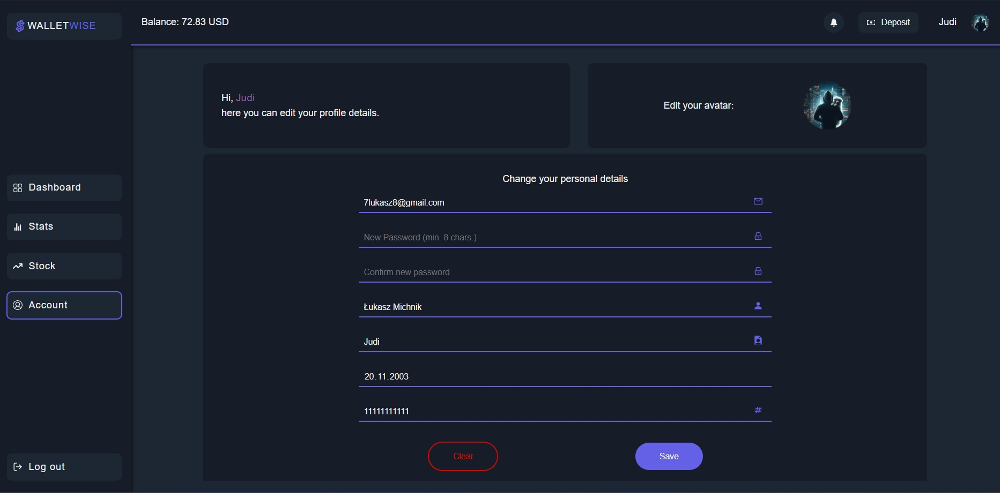
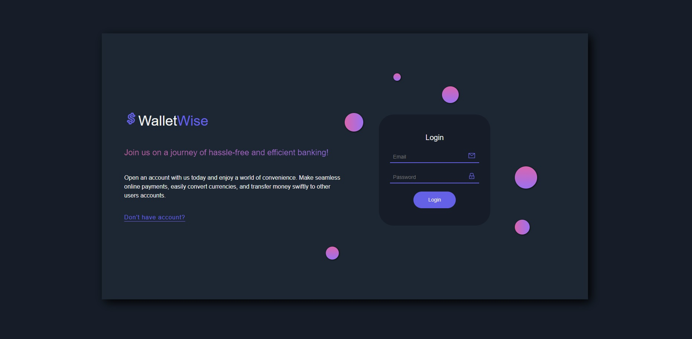

# Wallet-Wise

## About the project

Wallet Wise is an online wallet simulator, allows users to transfer funds between each other in different currencies. The application also includes an additional exchange rate api - Frankfurter API, allowing users to convert between different currencies on the market and transfer funds to others directly in the chosen currency. It has widely developed user data modification, including avatar, and other unique data, such as nickname. Each user has his mailbox made in supabase, which awaits on transfer orders, the history of each transaction and transfer is also collected.

Live - [Visit demo](https://wallet-wise-five.vercel.app/)

### Test accounts

E-mail: ```test@test.pl```
Password: ```testtest```

E-mail: ```test2@test.pl```
Password: ```testtest```

## Build with

[](https://reactjs.org/)
[](https://supabase.io/)
[](https://styled-components.com/)

## Pictures






## How to run

1. Clone the repo
   `git clone https://github.com/JudiJudi6/WalletWise.git`

2. Install NPM packages
   `npm i`

3. To run app
   `npm run dev`
